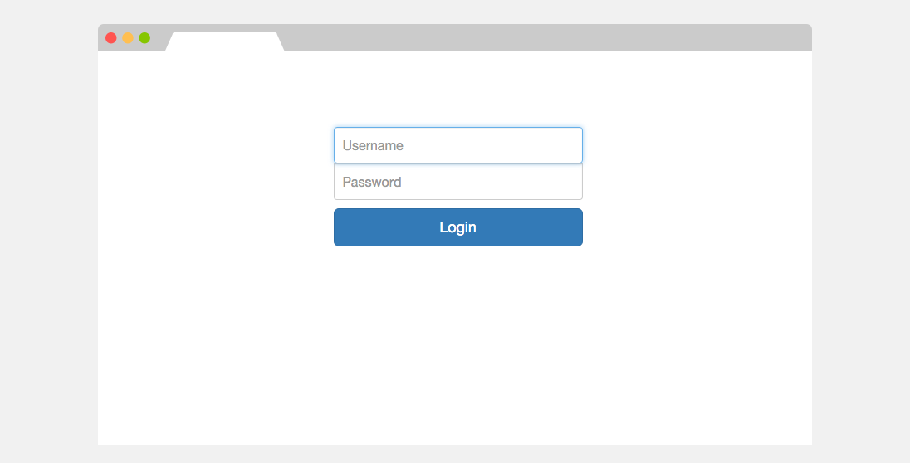
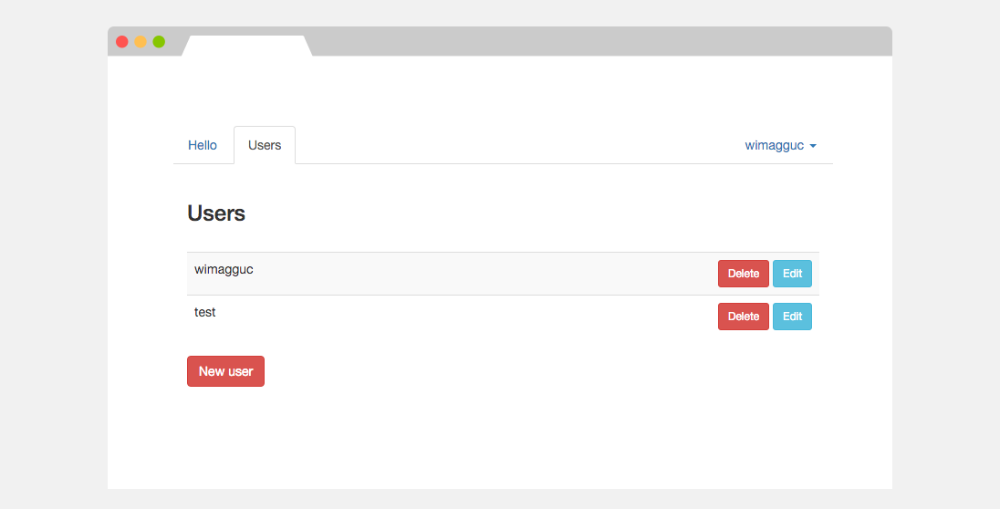
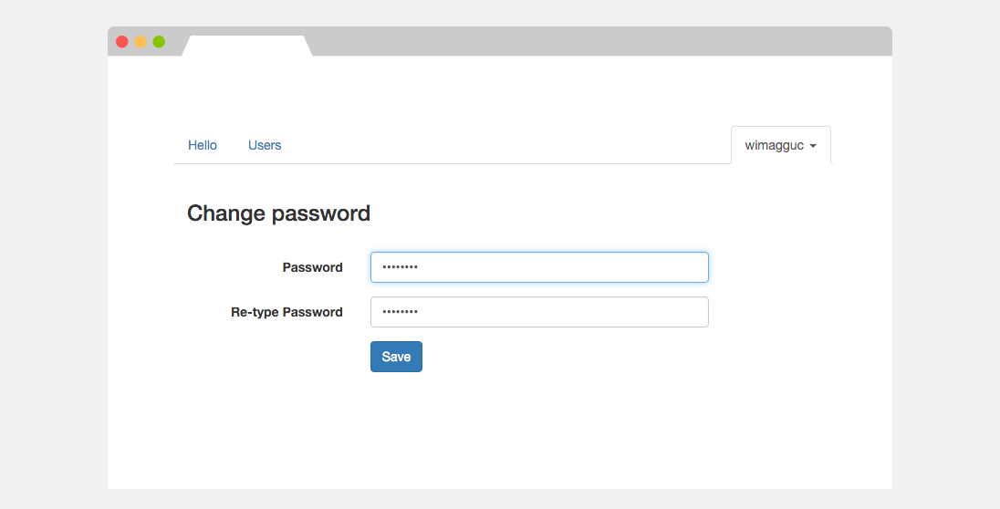
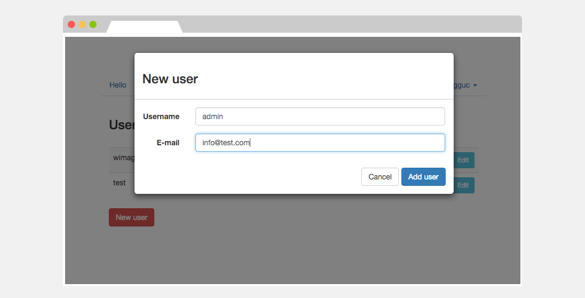

# React-Django Admin

Administration interface in React JS, and a simple Django Rest Framework (with OAuth2 provider) for the backend. Uses Bootstrap for the templates.

This is not meant to be a replacement of Django's admin. What this project is actually good for:

* You can provide a separate "administration" area for users
* Web login for any OAuth2-based API

## Screenshots









## TODO

  * Forgotten password
  * Many, many bugfixes are coming up

## Frontend

### To install the project:

    ```sh
    $ npm install
    ```

### For development, auto-building the resources:

    ```sh
    $ gulp watch
    ```

### Edit the config:

    The config is in `./js/config.js`; Copy the `./js/config.js.example` file, then change the API_URI parameter to the server you've set in the backend:

    ```js
    var RDAAppConfig = {};
    RDAAppConfig.Config = {
      API_URI : "http://localhost:5000",
      CLIENT_ID : "<YOUR_CLIENT_ID>",
      CLIENT_SECRET : "<YOUR_CLIENT_SECRET>",
      STORAGE_ID : "RDA_LOCALSTORAGE"
    };
    ```

### Run server:

    ```sh
    $ node server.js
    ```

    Visit http://localhost:8080/ in the browser.

### This project uses:

    * React.js
    * Bootstrap
    * Backbone.js
    * jQuery 2

## Backend

### To install the project:

    ```sh
    $ virtualenv venv
    $ source venv/bin/activate
    $ pip install -r requirements.txt
    $ python manage.py syncdb
    $ python manage.py collectstatic
    ```

### Run locally:

    ```sh
    $ foremen start
    ```

    Or, alternatively:

    ```sh
    $ python manage.py runserver
    ```

### Add the OAuth2 Credentials

    Run the server, then go to the address:

    http://localhost:5000/admin/oauth2_provider/application/add/

    Add:

    * CLIENT_ID, CLIENT_SECRET: the auto-generated keys
    * Client type: Confidental
    * Authorization grant type: Resource owner password-based
    * Name: any
    * User: any

## Used at

This is a proof-of-concept, not used anywhere in special.

However, feel free to add your link here and send a pull request.
